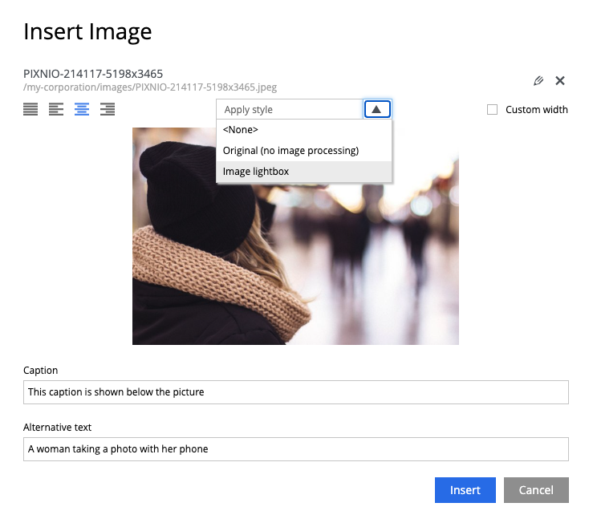

# Image lightbox App for Enonic XP

## Installing the app
Simply install the app from [Enonic Market](https://market.enonic.com) and add it to your site. There is no configuration needed.

If you are using you own Content-Security-Policy (CSP), be aware that if you do not have `'unsafe-inline'` in `style-src`,
this app might not work as expected out of the box, because styling from Enonic will not be allowed and you should probably add code to handle this in your own app.

## Using the app
When the app has been installed to a site, the editors will have the option of choosing the "Image lightbox" style when adding images to rich text fields (HtmlAreas).

The editor may use all other image options, including focal point, custom width, image text, alt text and alignment.

In preview or live mode, the image will be clickable.

## Developers
To get info about development, see [development documentation](code/src/docs/en/development.md).
